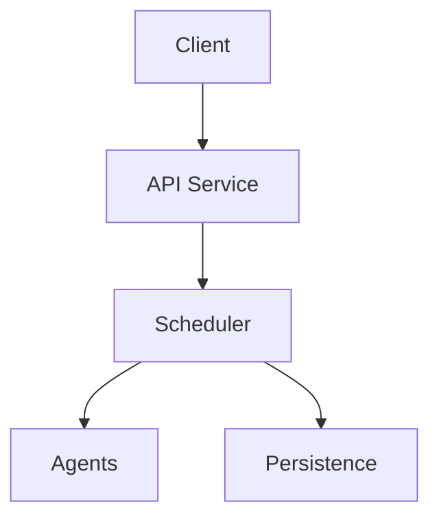

# Proposed Architecture

## Overview

The system will consist of a FastAPI backend exposing REST and WebSocket interfaces, a scheduler driving agent simulations, and optional web and CLI frontends.

## Components

- **API Service**: Handles HTTP requests, WebSocket connections, and scenario validation.
- **Scheduler**: Processes events and advances simulated time.
- **Agents**: Pluggable outer and inner workers communicating via the scheduler.
- **Persistence**: SQLite for state and checkpoint storage with a repository layer.
- **LLM Clients**: Interface allowing multiple providers with a default echo stub.
- **UI**: Lightweight HTML/JS panel for controlling simulations.

## Data Flow

Clients submit scenarios through the API. The scheduler executes events, invoking agent logic and persisting checkpoints. UI components poll or subscribe to state updates.

## Deployment

Initial deployment targets a single container running the API and scheduler. Future revisions may split workers into separate services and add persistent storage like Postgres.
